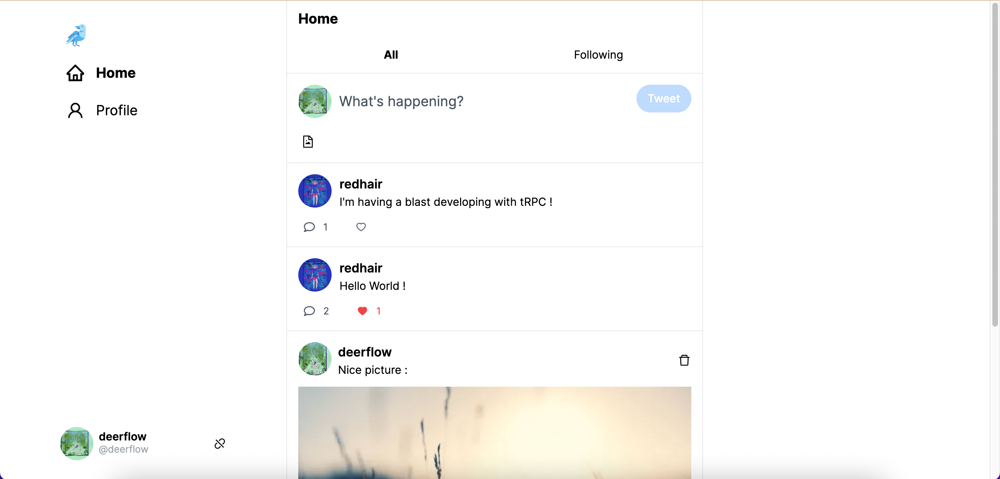
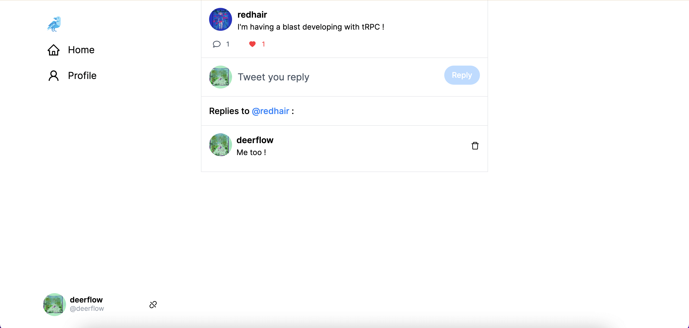
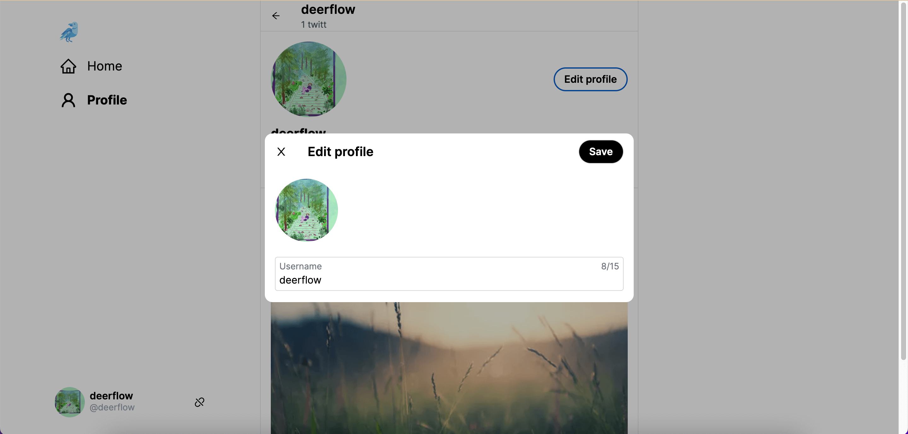

# Portfolio

&nbsp;&nbsp;&nbsp;&nbsp;&nbsp;&nbsp;&nbsp;&nbsp;&nbsp;&nbsp;&nbsp;&nbsp;&nbsp;&nbsp;&nbsp;

Twitter Clone App built with Next.js, tRPC, Prisma, Tailwind and TypeScript

## Features

-   Create, delete tweets (280 characters max) and add images/GIFs to tweets (Uploaded to ImageKit CDN)
-   Tweets feed (every tweets or followed users tweets)
-   Like and comment tweets
-   Follow users
-   Update your profile
-   Authentication (Built with Clerk)
-   Rate limiting (Built with Upstash)
-   Optimistic UI updates
-   Like twitter, this is a Single Page Application (No server-side rendering or static pages)

[Try me](https://twitty-nextjs.vercel.app/)

